# Schéma de la base de données - Projet du Mois

Ce document présente le schéma de la base de données avec les relations entre les tables.

```mermaid
erDiagram
    pdm_projects ||--o{ pdm_projects_points : "a des points"
    pdm_projects ||--o{ pdm_changes : "a des changements"
    pdm_projects ||--o{ pdm_user_contribs : "a des contributions"
    pdm_projects ||--o{ pdm_feature_counts : "a des comptages"
    pdm_projects ||--o{ pdm_note_counts : "a des notes"
    pdm_projects ||--o{ pdm_features_boundary : "a des objets par boundary"
    pdm_projects ||--o{ pdm_feature_counts_per_boundary : "a des comptages par boundary"
    pdm_projects ||--o{ pdm_quality_completion : "a des scores de qualité"
    pdm_projects ||--o{ pdm_quality_stats : "a des stats de qualité"
    pdm_projects ||--o{ pdm_compare_exclusions : "a des exclusions"
    
    pdm_user_names ||--o{ pdm_changes : "a fait des changements"
    pdm_user_names ||--o{ pdm_user_contribs : "a des contributions"
    
    pdm_projects {
        VARCHAR project PK
        TIMESTAMP start_date
        TIMESTAMP end_date
        TIMESTAMP lastupdate_date
    }
    
    pdm_projects_points {
        VARCHAR project PK,FK
        VARCHAR contrib PK
        INTEGER points
    }
    
    pdm_user_names {
        BIGINT userid PK
        VARCHAR username
    }
    
    pdm_changes {
        VARCHAR project PK,FK
        VARCHAR action
        VARCHAR osmid PK
        INT version PK
        TIMESTAMP ts
        VARCHAR username
        BIGINT userid FK
        JSONB tags
        VARCHAR contrib
        BIGINT changeset_id
    }
    
    pdm_user_contribs {
        VARCHAR project FK
        BIGINT userid FK
        TIMESTAMP ts
        VARCHAR contribution
        BOOLEAN verified
        INT points
    }
    
    pdm_feature_counts {
        VARCHAR project PK,FK
        TIMESTAMP ts PK
        INT amount
    }
    
    pdm_note_counts {
        VARCHAR project FK
        TIMESTAMP ts
        INT open
        INT closed
    }
    
    pdm_features_boundary {
        VARCHAR project FK
        VARCHAR osmid
        BIGINT boundary
        TIMESTAMP start_ts
        TIMESTAMP end_ts
    }
    
    pdm_feature_counts_per_boundary {
        VARCHAR project PK,FK
        BIGINT boundary PK
        TIMESTAMP ts PK
        INT amount
    }
    
    pdm_quality_completion {
        VARCHAR project PK,FK
        VARCHAR osmid PK
        TIMESTAMP ts PK
        INT completion_percentage
        TEXT[] tags_present
        TEXT[] tags_missing
    }
    
    pdm_quality_stats {
        VARCHAR project PK,FK
        TIMESTAMP ts PK
        INT total_objects
        NUMERIC avg_completion
        INT fully_complete
        INT partially_complete
        INT incomplete
    }
    
    pdm_compare_exclusions {
        VARCHAR project PK,FK
        VARCHAR osm_id PK
        TIMESTAMP ts
        BIGINT userid
    }
    
    pdm_note_counts_global {
        TIMESTAMP ts PK
        INT open
        INT closed
    }
    
    pdm_note_counts_per_boundary {
        BIGINT boundary PK
        TIMESTAMP ts PK
        INT open
        INT closed
    }
    
    pdm_relation_hiking ||--o{ pdm_relation_hiking_members : "a des membres"
    
    pdm_relation_hiking {
        BIGINT osm_id PK
        VARCHAR name
        JSONB tags
        GEOMETRY geom
        TIMESTAMP created_at
    }
    
    pdm_relation_hiking_members {
        BIGINT relation_id PK,FK
        TIMESTAMP ts PK
        INT member_count
        BIGINT changeset_id
        VARCHAR username
        BIGINT userid
    }
    
    pdm_leaderboard {
        VARCHAR project
        BIGINT userid
        VARCHAR username
        INT amount
        INT pos
    }
```

## Description des tables principales

### Tables de projets
- **pdm_projects** : Liste des projets avec leurs dates de début/fin
- **pdm_projects_points** : Points attribués par type de contribution pour chaque projet

### Tables de contributions
- **pdm_changes** : Historique des changements OSM par projet (ajouts, modifications, suppressions)
- **pdm_user_contribs** : Contributions des utilisateurs avec points attribués
- **pdm_user_names** : Noms d'utilisateurs OSM

### Tables de statistiques
- **pdm_feature_counts** : Nombre d'objets par projet et par date
- **pdm_feature_counts_per_boundary** : Nombre d'objets par projet, boundary et date
- **pdm_note_counts** : Statistiques de notes OSM par projet
- **pdm_note_counts_global** : Statistiques globales de notes (France)
- **pdm_note_counts_per_boundary** : Statistiques de notes par boundary

### Tables de qualité
- **pdm_quality_completion** : Score de complétude par objet et date
- **pdm_quality_stats** : Statistiques agrégées de qualité par projet et date

### Tables géographiques
- **pdm_features_boundary** : Association objets/boundaries avec historique
- **pdm_relation_hiking** : Relations de randonnée (OSM Plein Air)
- **pdm_relation_hiking_members** : Évolution du nombre de membres des relations

### Tables utilitaires
- **pdm_compare_exclusions** : Exclusions pour la comparaison OSM
- **pdm_leaderboard** : Vue calculée du classement des contributeurs

